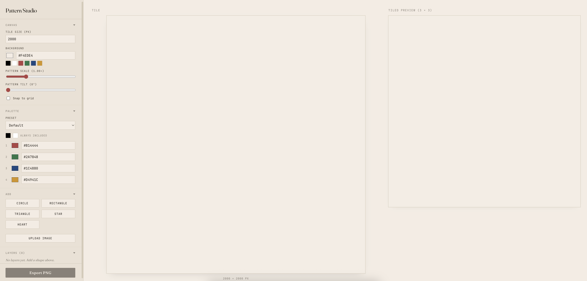
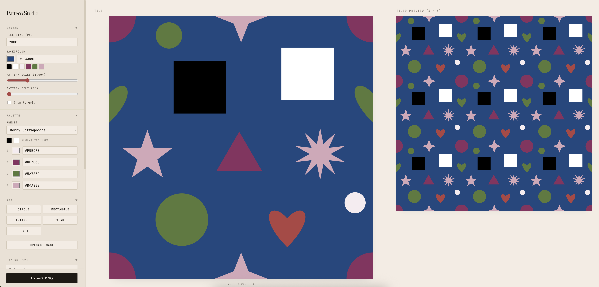
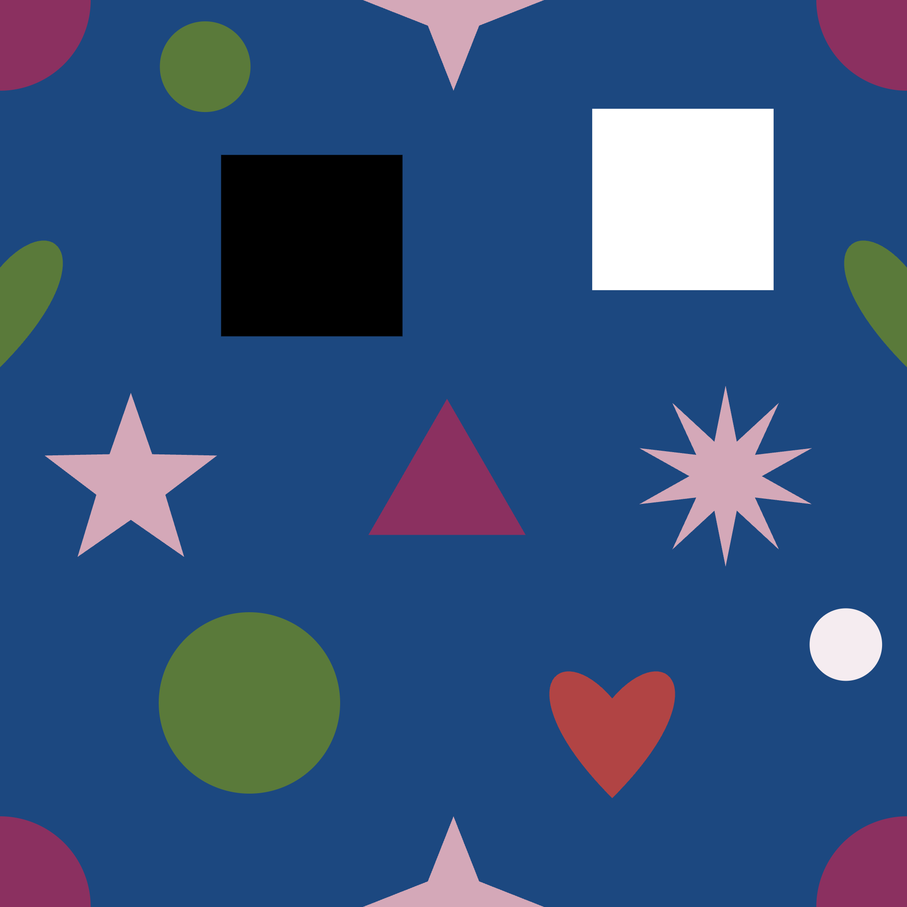
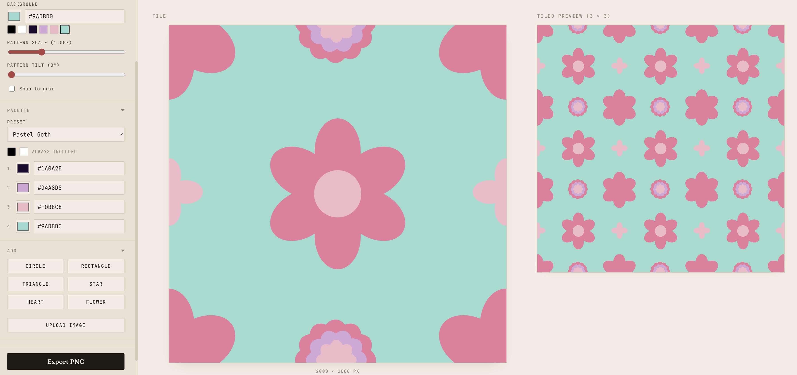

# Cedar Pattern Studio

Local-only seamless pattern generator. Square tiles (default 2000×2000 px), exports to PNG ready for square tiles for print on demand. Use the built in basic shapes (with layering!) or pull in your own graphics or clipart. Canvas allows free-form or snap to grid alignment.

## Screenshots


*App on first open — clean canvas ready for shapes*


*Editor with the Berry Cottagecore palette, showing the tile and live 3×3 tiled preview*


*Full-resolution PNG export — all five shape types with seamless edge wrapping*


*Flower shape builder — flowers with various numbers of petals in the same pattern*

## Run

```
npm install
npm run dev
```

Open the URL Vite prints (usually `http://localhost:5173`).

## Features

**Canvas controls**
- Tile size (500–6000 px)
- Background color
- Pattern scale — scales all layers around the tile center
- Pattern tilt — rotates the entire pattern 0–360° around the tile center
- Snap to grid — optional grid snapping with configurable grid size (tile px); a dashed grid overlay appears on the canvas when enabled

**Shapes & images**
- Add circles, rectangles, triangles, stars, and hearts
- Upload PNG or SVG images as layers
- All shapes seamlessly wrap at tile edges

**Canvas interaction**
- Click a shape to select it
- Drag shapes directly on the canvas to reposition; respects snap-to-grid and pattern tilt
- Selected layer details appear in the sidebar for numeric editing

**Layers**
- Drag the ⠿ handle to reorder layers in the sidebar
- Delete individual layers

**Palette**
- 26 built-in palette presets (Default + 25 curated themes including Boho Terracotta, Japanese Indigo, Y2K Acid, The Matrix, Pastel Goth, and more)
- Override any of the 4 palette slots manually; dropdown shows "— Custom —" when edited
- Black and white are always available as quick-pick swatches
- Every color picker shows the current 6-swatch palette row for quick selection

**Export**
- Export PNG at full tile resolution

## Architecture

- **`src/lib/render.ts`** — Core render logic. `getWrapOffsets` handles seamless edge wrapping. `applyPatternScale` applies both global scale and tilt to a layer's position (exported for hit-testing in EditorCanvas). `getBoundingRadius` gives the rotation-invariant bounding circle per shape kind.
- **`src/lib/palettes.ts`** — The 26 named palette presets as static data.
- **`src/types/pattern.ts`** — `PatternState` and the `Layer` discriminated union.
- **`src/store/store.ts`** — Zustand store. All state lives here; `exportPNG` is a pure function of state, so multi-colorway export remains straightforward.
- **`src/lib/imageRegistry.ts`** — `HTMLImageElement` instances held outside the serializable store; layers reference images by ID.
- **`src/lib/export.ts`** — PNG export at full resolution (no grid overlay — the overlay is only drawn in the editor).
- **`src/components/`** — React UI: `Sidebar`, `EditorCanvas`, `TilePreview`.

## Notes for future versions

- **Palette refs (V3):** Fill colors are stored as hex strings on layers. For palette-swap colorways, refactor fills to named refs (`fill: 'color1'`) before this gets scattered across many layers. Multi-colorway export would then be `palettes.map(p => exportPNG({...state, paletteMap: p}))`.
- **Palette collections (planned):** UI scaffolding for loading and saving named palettes is the natural next step. The preset list in `palettes.ts` is the seed data.
- **Pattern scale/tilt are render-time only:** Layer positions are stored in "natural" tile coordinates. Scale and tilt are applied at render time via `applyPatternScale`, so geometry stays clean for future remixing.

## Print service reference

Both Spoonflower and Printful work from pixel dimensions, not embedded DPI metadata — no `pHYs` chunk needed.

| Service | Size | Notes |
|---|---|---|
| Spoonflower basic | 2000×2000 px | 13.3" repeat at 150 DPI |
| Printful (cases/stickers) | 2000×2000 px | 6.67" at 300 DPI |
| Spoonflower wallpaper | 3600×3600 px | 24" × 150 DPI = 3600 px width |
